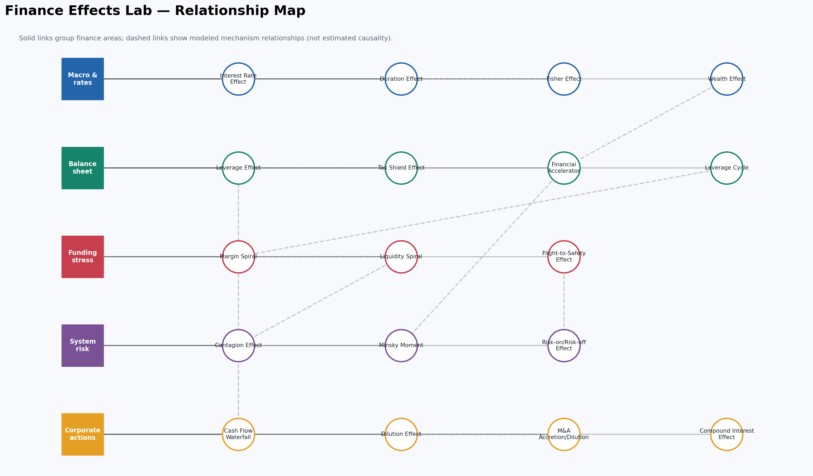
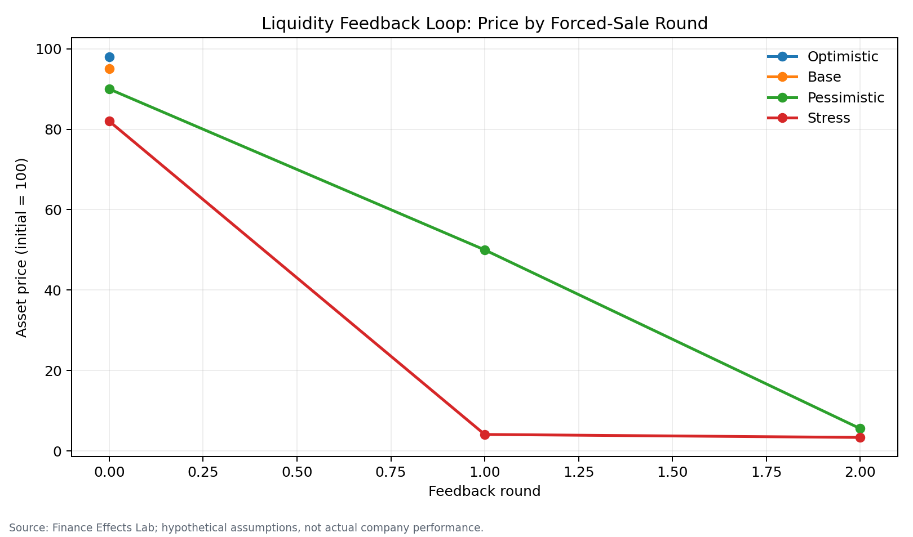
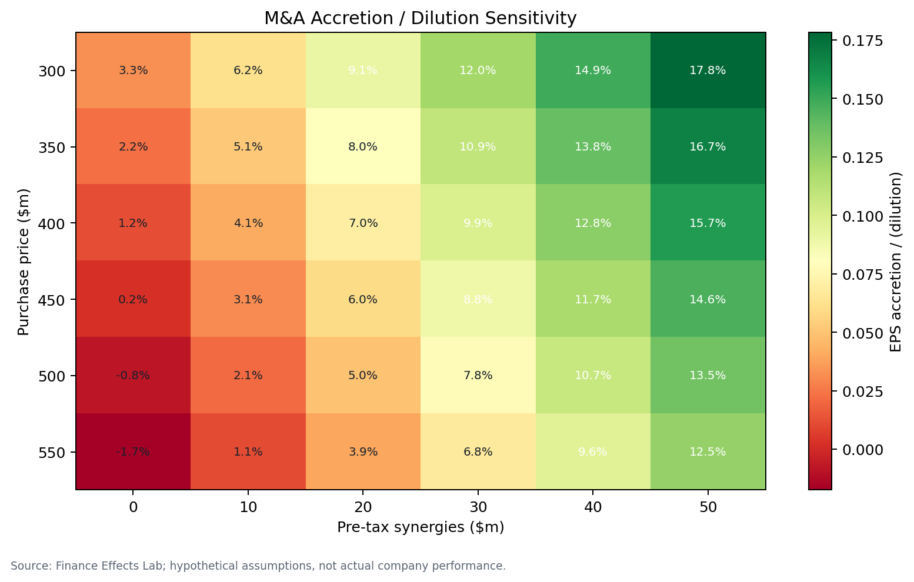

# Finance Effects Lab

[](https://www.python.org/)
[](#individual-models)
[](#quality-controls)
[](LICENSE)

> **A recruiter-ready financial modelling and research portfolio:** 18 auditable models, 4 scenarios per model, 2-way sensitivities, 36+ charts, Excel/Power BI outputs, Jupyter notebooks, documented evidence, and formula tests.

## Executive Summary

Finance Effects Lab translates important corporate-finance and financial-markets mechanisms into practical numerical models. It covers capital structure, banking, private markets, fixed income, asset allocation, valuation, financial economics, and systemic risk.

This is not a glossary. Every effect has:

- a formula with defined variables and traceable Python implementation;
- optimistic, base, pessimistic, and stress cases with editable CSV inputs;
- a two-driver sensitivity table and professional visualization;
- intermediate calculations, business interpretation, limitations, and role-specific implications;
- documented versus illustrative institutional examples with public-source links;
- Excel-compatible workbooks, Power BI-ready long-form CSVs, and a Jupyter walkthrough;
- beginner, intermediate, and advanced interview questions with model answers.

**Evidence boundary:** all committed numerical assumptions are hypothetical. They are not actual company results or forecasts. Public sources provide research/case context and are cataloged with access dates and transformations.

## Why This Project Exists

Finance interviews and analyst work require more than definitions. A strong answer must connect a mechanism to financial statements, valuation, cash priority, market prices, or risk capacity—and explain what changes under stress. This project demonstrates that complete workflow in a format a reviewer can audit quickly.

The architecture is intentionally simple: Python modules contain financial logic; CSV files hold assumptions; notebooks explain the workflow; pandas exports tables; Matplotlib/Plotly communicate results; pytest protects key identities. It is a finance portfolio, not an over-engineered software product.

## Finance Concepts Covered

- **Corporate finance:** leverage, tax shields, share dilution, M&A accretion/dilution, compounding.
- **Fixed income and treasury:** full bond repricing, duration, convexity, nominal/real rates.
- **Private markets:** senior/mezzanine debt service, preferred return, GP catch-up, carried interest.
- **Banking and credit:** collateral, financial accelerator, margin and liquidity constraints.
- **Portfolio management:** wealth, flight to safety, and risk-on/risk-off allocation.
- **Systemic risk:** contagion networks, leverage cycles, and a simplified Minsky mechanism.

## Technology Stack

| Tool | Purpose |
|---|---|
| Python 3.11 | Model logic and automation |
| pandas / NumPy | Scenario tables, arrays, and calculations |
| Matplotlib / Plotly | Static finance charts and interactive dashboard |
| NetworkX | Synthetic contagion and relationship networks |
| Jupyter | Explainable analyst workflow |
| openpyxl | Excel-compatible workbooks |
| pytest | Formula, invariant, and smoke tests |
| CSV / Markdown / Git | Power BI handoff, documentation, and version control |

## Architecture

```text
sample_data.csv → effect module → scenario + sensitivity DataFrames
                              ├→ PNG charts
                              ├→ model CSV + XLSX
                              ├→ Jupyter notebook
                              └→ consolidated dashboard / Power BI CSV
```

Each model is self-contained under `models/<effect>/` with `README.md`, `model.py`, `notebook.ipynb`, `sample_data.csv`, `outputs/`, and `charts/`. Shared helpers standardize validation and presentation, but each effect's financial equations remain visible in its own source module.

See [Project Architecture](docs/architecture.md) and [Methodology & Model Governance](docs/methodology.md).

## Individual Models

| Effect | Finance Area | Numerical Model | Visualization | Real-World Application |
|---|---|---|---|---|
| [Leverage Effect](models/leverage_effect/) | Corporate finance | Debt → interest → tax → NI → ROE at 0/25/50/75% debt | ROE lines + sensitivity heatmap | Capital structure / LBO downside |
| [Financial Accelerator](models/financial_accelerator/) | Banking / economics | Collateral shock → credit capacity → investment | Scenario bars + collateral grid | Credit underwriting / capex planning |
| [Liquidity Spiral](models/liquidity_spiral/) | Market risk | Iterative margin breach → sale → price impact | Feedback path + ending-price grid | Levered portfolio liquidity |
| [Margin Spiral](models/margin_spiral/) | Counterparty risk | Volatility → haircut → debt-capacity contraction | Haircut path + forced-sale grid | Prime brokerage / collateral |
| [Cash Flow Waterfall](models/cash_flow_waterfall/) | Private markets | Revenue through debt, preference, catch-up, and carry | Stakeholder waterfall + carry grid | PE / project finance |
| [Interest Rate Effect](models/interest_rate_effect/) | Fixed income | Full coupon-bond repricing at ±100/200 bp | Price-change bars + maturity grid | Treasury securities book |
| [Duration Effect](models/duration_effect/) | Fixed income risk | Macaulay, modified duration, convexity, exact price | Approximation bars + duration grid | ALM / rate hedging |
| [Tax Shield Effect](models/tax_shield/) | Corporate finance | Levered vs unlevered tax, NI, and FCF | Shield bars + debt/tax grid | Capital structure valuation |
| [Wealth Effect](models/wealth_effect/) | Financial economics | Wealth shock × MPC → consumption | Consumption bars + MPC grid | Consumer-demand scenarios |
| [Contagion Effect](models/contagion_effect/) | Systemic risk | Six-node default cascade with recovery/capital | Exposure network + defaults grid | Counterparty stress testing |
| [Minsky Moment](models/minsky_moment/) | Financial stability | Credit expansion → DSR trigger → deleveraging | 12-period price path + drawdown grid | Educational cycle analysis |
| [Flight-to-Safety](models/flight_to_safety/) | Asset allocation | Risk-aversion flow and market-depth impact | Flow bars + depth grid | Stress allocation / liquidity |
| [Risk-on/Risk-off](models/risk_on_risk_off/) | Portfolio management | Multi-asset return contribution by regime | Contribution bars + allocation grid | Portfolio scenario review |
| [Leverage Cycle](models/leverage_cycle/) | Financial economics | Collateral/haircut → debt capacity → leverage | Leverage path + procyclicality grid | Secured funding cycle |
| [Dilution Effect](models/dilution_effect/) | Equity capital markets | Share issuance → ownership and EPS | EPS bars + issuance/ROI grid | Follow-on offering analysis |
| [M&A Accretion/Dilution](models/ma_accretion_dilution/) | Investment banking | Target NI + synergy − financing → pro forma EPS | EPS bars + price/synergy grid | Buy-side/sell-side advisory |
| [Compound Interest](models/compound_interest/) | Investments | Principal + recurring contributions over time | Growth curves + horizon/rate grid | Savings / long-range planning |
| [Fisher Effect](models/fisher_effect/) | Macro / rates | Exact nominal-real-inflation relationship | Real-rate bars + nominal/inflation grid | Real funding-cost analysis |

## Key Findings

1. **Leverage is symmetric in mechanism, asymmetric in consequences.** A smaller equity base increases ROE when operating return clears debt cost and accelerates losses when it does not.
2. **Funding and market liquidity cannot be stressed independently.** In the spiral models, a constraint breach converts a mark-to-market loss into forced flow, making shallow-market impact the critical nonlinear driver.
3. **Payment priority determines value allocation.** The waterfall shows why adequate EBITDA does not imply sponsor distribution when senior and mezzanine claims absorb cash first.
4. **Duration is an approximation, not a price.** Full repricing is the benchmark; convexity reduces error for larger parallel shifts, while nonparallel curve and optionality risks remain.
5. **EPS accretion is not economic value creation.** Purchase price, funding mix, rate, synergy timing, and new shares can create accounting accretion even when transaction NPV is unattractive.
6. **Buffers and recoveries shape cascades.** In a fixed synthetic exposure network, higher capital and recovery contain second-round defaults; the network is educational and not a map of actual firms.
7. **Model governance matters as much as formulas.** Every output is labeled hypothetical, intermediate lines remain visible, and tests target finance identities rather than cosmetic code coverage.

## Example Outputs

### Portfolio relationship map



### Selected model charts

| Liquidity feedback | M&A sensitivity |
|---|---|
|  |  |

Open [`outputs/portfolio_dashboard.html`](outputs/portfolio_dashboard.html) for the interactive 18-model dashboard. Metrics use different units, so the dashboard supports within-model base-versus-stress interpretation rather than cross-model ranking.

## How to Run

### Option A — pip / virtual environment

```bash
git clone [YOUR_GITHUB_URL]
cd finance-effects-lab
python -m venv .venv
source .venv/bin/activate             # Windows: .venv\Scripts\activate
python -m pip install --upgrade pip
python -m pip install -e ".[dev]"
python -m finance_effects_lab         # refresh all 18 models + dashboard
pytest
jupyter lab
```

### Option B — Conda

```bash
conda env create -f environment.yml
conda activate finance-effects-lab
python -m pip install -e .
python -m finance_effects_lab
pytest
```

### Run one model

```bash
python models/leverage_effect/model.py
```

Edit that model's `sample_data.csv` first. Percentages are decimals: enter `0.06`, not `6`, for 6%.

### Main generated files

- `models/<effect>/outputs/scenario_results.csv`
- `models/<effect>/outputs/sensitivity_results.csv`
- `models/<effect>/outputs/<effect>.xlsx`
- `outputs/power_bi_all_scenarios.csv`
- `outputs/power_bi_all_sensitivities.csv`
- `outputs/power_bi_scenario_metrics_long.csv`
- `outputs/power_bi_sensitivity_metrics_long.csv`
- `outputs/finance_effects_lab.xlsx`
- `outputs/portfolio_dashboard.html`

## Data Sources

Committed runs use synthetic assumptions only. Public Federal Reserve, FRED, BIS, IMF, SEC, FCIC, RBI, and issuer sources provide conceptual or documented case context. Each source records URL, access date, metric, transformation, use, and calculation status in [`data/source_catalog.csv`](data/source_catalog.csv).

An optional, no-key FRED downloader retrieves Treasury nominal yield, Treasury real yield, and CPI series for future empirical extensions:

```bash
python data/download_public_data.py
```

Read [Data Governance](data/README.md) and [Public Data and Evidence Sources](docs/data_sources.md).

## Methodology

1. Define the finance mechanism and variables.
2. Implement the smallest transparent equation set that demonstrates it.
3. Expose intermediate financial-statement, cash-flow, pricing, or risk lines.
4. Run four editable deterministic scenarios.
5. Vary two important drivers in a sensitivity grid.
6. Produce a labeled chart and export the underlying long-form table.
7. Translate the result into role-specific decisions.
8. State assumptions, limitations, and evidence boundary.
9. Test identities, directions, constraints, and stress invariants.

Detailed conventions: [Methodology & Model Governance](docs/methodology.md).

## Assumptions

- All sample cases are invented educational scenarios.
- Rates are decimal annual rates unless stated otherwise.
- Most currency values are hypothetical USD millions; chart labels control.
- Taxes are simplified cash taxes and do not replace jurisdiction-specific tax analysis.
- Fixed-income shocks are parallel and deterministic.
- Network names and exposures are synthetic.
- Feedback-cycle coefficients illustrate mechanisms and are not empirically calibrated.

## Limitations

- Deterministic scenarios do not provide probability distributions or confidence intervals.
- One-period corporate models omit detailed accounting, legal, tax, and financing terms.
- Liquidity, margin, contagion, and Minsky modules are simplified educational systems—not prediction engines.
- Public sources are contextual; current sample outputs are not calibrated to live markets or actual companies.
- Excel files are outputs, not interactive formula workbooks; the version-controlled Python is the calculation source.
- Portfolio metrics cannot be ranked across effects because units and economic meaning differ.

## Quality Controls

```bash
pytest
```

The suite checks all 18 modules plus known identities and invariants: par-bond pricing, price/yield direction, duration bounds, leverage upside/downside, taxable-capacity limits, waterfall cash conservation, Fisher round-trip, zero-rate compounding, allocation weights, and network capital behavior.

## Future Improvements

- Calibrate selected rate and inflation modules with versioned FRED observations.
- Add SEC XBRL ingestion with accession-level provenance and taxonomy mapping.
- Extend duration to key-rate duration, spread duration, and embedded options.
- Add multi-period debt schedules, covenants, PIK, IRR hurdles, and exit waterfalls.
- Add Monte Carlo distributions while retaining deterministic interview cases.
- Estimate nonlinear market impact from licensed historical data.
- Add legal netting, collateral, and common-asset fire sales to contagion.
- Publish a Power BI `.pbix` separately where binary-file review and licensing permit.

## Career Materials

Ready-to-edit materials are in [`docs/professional_materials.md`](docs/professional_materials.md):

- LinkedIn project description;
- LinkedIn launch post;
- five resume bullet points;
- timed five-minute interview walkthrough.

## Author

**[YOUR_NAME]**<br>
GitHub: [YOUR_GITHUB_URL]<br>
LinkedIn: [YOUR_LINKEDIN_URL]<br>
Portfolio: [YOUR_PORTFOLIO_URL]

## Disclaimer

Educational portfolio only. Nothing in this repository is investment, legal, accounting, tax, or risk-management advice. Hypothetical results are not actual company performance, market forecasts, or recommendations.

## License

[MIT License](LICENSE)
